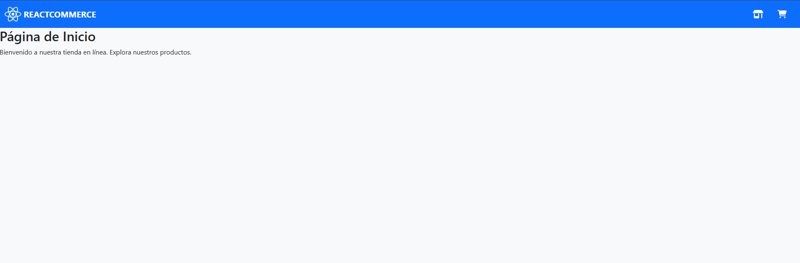

# ReactCommerce - Frontend E-commerce

 

Frontend completo para una aplicación E-commerce ("ReactCommerce") construido con React, Vite, Bootstrap y JavaScript moderno. El proyecto simula la experiencia de una tienda online, incluyendo navegación por productos, detalles de producto, y gestión de carrito de compras.

**Este proyecto se está desarrollando como parte de un proceso de aprendizaje guiado.**

## Tabla de Contenidos

*   [Características Principales](#características-principales)
*   [Tecnologías Utilizadas](#tecnologías-utilizadas)
*   [Instalación y Uso Local](#instalación-y-uso-local)
*   [Estructura del Proyecto](#estructura-del-proyecto)
*   [Estado del Proyecto](#estado-del-proyecto)
*   [Próximos Pasos / Mejoras Futuras](#próximos-pasos--mejoras-futuras)
*   [Contacto](#contacto)
*   [Plan de Iteraciones](#plan-de-iteraciones)

## Características Principales

*   Navegación entre páginas (Home, Productos, Carrito) usando React Router.
*   Visualización de productos en una cuadrícula responsiva.
*   Página dedicada para ver los detalles de cada producto.
*   Funcionalidad para añadir productos al carrito de compras.
*   Gestión del estado del carrito mediante React Context API.
*   Página para visualizar y gestionar los ítems del carrito.
*   Diseño estilizado con Bootstrap 5.
*   _(Próximamente: Búsqueda, Filtrado por Categoría, Checkout Simulado...)_

## Tecnologías Utilizadas

*   **[React](https://reactjs.org/) (v18+)**: Librería principal para construir la interfaz de usuario.
    *   Hooks (`useState`, `useEffect`, `useContext`)
*   **[Vite](https://vitejs.dev/)**: Herramienta de construcción frontend rápida.
*   **[React Router DOM](https://reactrouter.com/) (v6+)**: Para el enrutamiento del lado del cliente (SPA).
*   **[Bootstrap](https://getbootstrap.com/) (v5+)**: Framework CSS para diseño y componentes de UI.
*   **JavaScript (ES6+)**: Lenguaje base con características modernas.
*   **[FakeStoreAPI](https://fakestoreapi.com/)**: API REST utilizada para obtener datos de productos.
*   **CSS3**: Para estilos personalizados adicionales (si aplica).
*   **NPM / Yarn**: Gestor de paquetes.
*   **Git / GitHub**: Control de versiones.


## Instalación y Uso Local

Sigue estos pasos para ejecutar el proyecto en tu máquina local:

1.  **Clona el repositorio:**
    ```bash
    git clone https://github.com/tu-usuario/react-commerce.git
    cd react-commerce
    ```
2.  **Instala las dependencias:**
    ```bash
    # Usando npm
    npm install
    # O usando yarn
    # yarn install
    ```
3.  **Inicia el servidor de desarrollo:**
    ```bash
    # Usando npm
    npm run dev
    # O usando yarn
    # yarn dev
    ```
4.  Abre tu navegador y visita `http://localhost:5173` (o la URL indicada en la terminal).

## Estructura del Proyecto
react-commerce/
├── public/
└── src/
├── assets/ # Imágenes, fuentes, etc.
├── components/ # Componentes reutilizables (Navbar, ProductCard, CartItem...)
├── context/ # React Context API (CartContext...)
├── data/ # (Opcional) Datos mock locales si no se usa API
├── pages/ # Componentes de página (HomePage, ProductsPage...)
├── router/ # Configuración de React Router (AppRouter)
├── services/ # Funciones para interactuar con APIs (productService)
├── App.jsx # Componente raíz principal
├── index.css # Estilos globales
└── main.jsx # Punto de entrada de la aplicación
├── .gitignore
├── index.html
├── package.json
├── README.md
└── vite.config.js

## Estado del Proyecto

El proyecto se encuentra actualmente en desarrollo, siguiendo un plan de iteraciones semanales.

*   **Iteración Actual:** Iteración 2 - Visualización de Productos
*   **Próximo Objetivo:** Iteración 3: Página de Detalles del Producto

## Próximos Pasos / Mejoras Futuras

*   Implementar búsqueda de productos.
*   Añadir filtrado por categorías.
*   Permitir modificar la cantidad de ítems en el carrito.
*   Crear página de checkout simulada.
*   Mejorar manejo de errores y estados de carga.
*   Añadir pruebas unitarias/integración.

## Contacto

[David Becerra] - [[LinkedIn](https://www.linkedin.com/in/david-becerra-p?lipi=urn%3Ali%3Apage%3Ad_flagship3_profile_view_base_contact_details%3BA7E3Q2RbS8alOB4zLu7tdg%3D%3D)] - [dbecerra655@gmail.com]

Link del Proyecto: [https://github.com/MrLeonard7/react-commerce]

## Plan de Iteraciones 
### ReactCommerce (24 Abril - 24 Mayo)

**Metodología:** Agile con flujo Kanban. 1 Historia de Usuario / Objetivo Principal por iteración semanal.

**Épica:** Frontend "ReactCommerce" - Crear una interfaz de usuario moderna, funcional y responsiva para una tienda online ficticia, utilizando React, Bootstrap y JavaScript moderno, enfocándose en las mejores prácticas y la gestión de estado.

---

### Iteración 1: Setup & Esqueleto Básico (Mié 24 Abr - Vie 26 Abr)

*   **Objetivo Principal / HU:** Configuración Inicial, Estructura, Routing y Navegación Básica (Base de HU-01).
*   **Foco Técnico / Tareas:**
    *   [X] **(Tarea 1)** Configuración Inicial del Proyecto (Vite, limpieza).
    *   [X] **(Tarea 2)** Instalar y Configurar Dependencias Clave (Router, Bootstrap).
    *   [X] **(Tarea 3)** Estructura Básica de Carpetas (`components`, `pages`, `router`, etc.).
    *   [X] **(Tarea 4)** Configurar Routing Básico (`/`, `/products`, `/cart` con placeholders).
    *   [X] **(Tarea 5)** Crear Navbar Básica (Componente `Navbar` con `Link`s y Bootstrap).

---

### Iteración 2: Visualización de Productos (Lun 29 Abr - Vie 3 May)

*   **Objetivo Principal / HU:** **(HU-02)** Visualización de Productos.
*   **Foco Técnico / Tareas:**
    *   [X] **(Tarea 6)** Configurar Fuente de Datos (FakeStoreAPI/Mock).
    *   [X] **(Tarea 7)** Crear Servicio de Productos (`getAllProducts()` en `src/services/`).
    *   [X] **(Tarea 8)** Obtener y Mostrar Datos Crudos en `ProductsPage` (`useState`/`useEffect`).
    *   [X] **(Tarea 9)** Crear Componente `ProductCard` (Diseño reutilizable con Bootstrap).
    *   [X] **(Tarea 10)** Renderizar `ProductCard`s en `ProductsPage` (Mapeo y grid).
    *   [X] **(Tarea 11)** Añadir Manejo Básico de Carga/Error en `ProductsPage`.

---

### Iteración 3: Página de Detalles del Producto (Lun 6 May - Vie 10 May)

*   **Objetivo Principal / HU:** **(HU-03)** Detalles del Producto.
*   **Foco Técnico / Tareas:**
    *   [X] Definir ruta dinámica (`/products/:id`).
    *   [X] Crear función `getProductById()` en el servicio.
    *   [X] Crear `ProductDetailPage.jsx`.
    *   [X] Obtener parámetro `id` de la URL (`useParams`).
    *   [X] Llamar al servicio con `useEffect` para obtener datos del producto.
    *   [X] Mostrar detalles completos del producto (imagen, descripción, precio).
    *   [ ] Añadir botón "Añadir al Carrito" (sin funcionalidad aún).
    *   [ ] Manejo de carga/error para producto individual.

---

### Iteración 4: Introducción al Carrito & Añadir Ítem (Lun 13 May - Vie 17 May)

*   **Objetivo Principal / HU:** **(HU-04)** Añadir al Carrito & Configuración del Estado Global.
*   **Foco Técnico / Tareas:**
    *   [ ] Configurar React Context API para el carrito (`CartContext.jsx`, `CartProvider`).
    *   [ ] Definir estado del carrito (array de ítems) y funciones (añadir, eliminar, etc.) en el Provider.
    *   [ ] Envolver la aplicación con `CartProvider`.
    *   [ ] Crear hook `useCart()` para acceder al contexto.
    *   [ ] Implementar la lógica "Añadir al Carrito" en los botones correspondientes (`ProductDetailPage`, `ProductCard`).
    *   [ ] (Opcional) Mostrar contador de ítems en la Navbar.

---

### Iteración 5: Visualización y Gestión Básica del Carrito (Lun 20 May - Vie 24 May)

*   **Objetivo Principal / HU:** **(HU-05)** Visualización y Gestión Básica del Carrito.
*   **Foco Técnico / Tareas:**
    *   [ ] Crear `CartPage.jsx`.
    *   [ ] Leer los ítems del carrito desde el Context (`useCart`).
    *   [ ] Crear componente `CartItem.jsx`.
    *   [ ] Mostrar la lista de `CartItem`s en `CartPage`.
    *   [ ] Calcular y mostrar subtotal/total.
    *   [ ] Implementar botón/lógica "Eliminar del Carrito" para cada `CartItem`.
    *   [ ] Manejar el caso de carrito vacío.

---

**Funcionalidades Probablemente Fuera de Alcance (Post 24 Mayo):**

*   Modificación avanzada del carrito (cambiar cantidad) (HU-05 Parte 2).
*   Navegación por Categorías (HU-07).
*   Búsqueda de Productos (HU-06).
*   Simulación de Checkout (HU-08).
*   Pulido avanzado de estilos y manejo de errores/carga.
